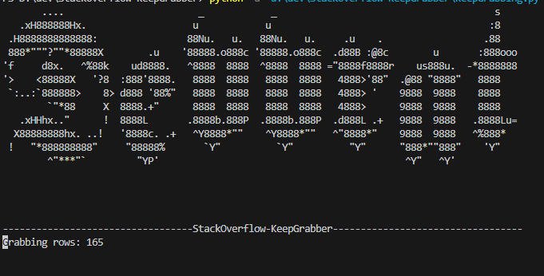
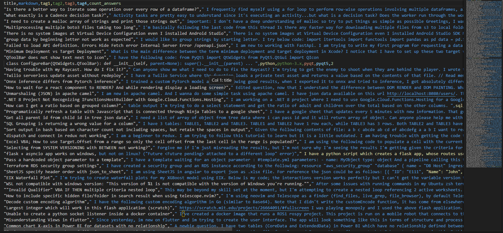

# StackOverflow-KeepGrabber
> A Python script to store the recent questions uploaded on StackOverflow as a csv file, can be used as a training dataset.



What about the data it grabs:
---> title,markdown,tag1,tag2,tag3,tag4,count_answers


*Sample csv is in repository*

Okay let's not `exploit` it, it is only for educational purposes!

### Setup

```sh
pip install bs4
```
then to run:
```sh
python -u /path/to/KeepGrabbing.py
```

Some cahnge can be made to the KeepGrabbing.py to grab even more!

